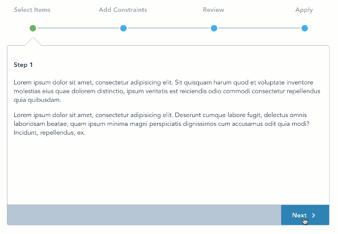

# vue-good-wizard
An easy and clean VueJS 2.x wizard plugin



## Getting Started

### Prerequisites

The plugin is meant to be used with existing VueJS 2.x projects.


### Installing

Install with npm:
```
npm install --save vue-good-wizard
```

import into project:
```
import Vue from 'vue';
import VueGoodWizard from 'vue-good-wizard';

Vue.use(VueGoodWizard);
```

## Example Usage

```html
<template>
  <div>
    <vue-good-wizard 
      :steps="steps"
      :onNext="nextClicked" 
      :onBack="backClicked">
      <div slot="page1">
        <h4>Step 1</h4>
        <p>This is step 1</p>
      </div>
      <div slot="page2">
        <h4>Step 2</h4>
        <p>This is step 2</p>
      </div>
      <div slot="page3">
        <h4>Step 3</h4>
        <p>This is step 3</p>
      </div>
      <div slot="page4">
        <h4>Step 4</h4>
        <p>This is step 4</p>
      </div>
    </vue-good-wizard>
  </div>
</template>

<script>
export default {
  name: 'demo',
  data(){
    return {
      steps: [
        {
          label: 'Select Items',
          slot: 'page1',
        },
        {
          label: 'Add Constraints',
          slot: 'page2',
        },
        {
          label: 'Review',
          slot: 'page3',
        },
        {
          label: 'Apply',
          slot: 'page4',
        }
      ],
    };
  },
  methods: {
    nextClicked(currentPage) {
      console.log('next clicked', currentPage)
      return true; //return false if you want to prevent moving to next page
    },
    backClicked(currentPage) {
      console.log('back clicked', currentPage);
      return true; //return false if you want to prevent moving to previous page
    }
  },
};
</script>
```
This should result in the screenshot seen above

### Component Options
<table>
  <thead>
    <tr>
      <th>Option</th>
      <th>Description</th>
      <th>Type, Example</th>
    </tr>
  </thead>
  <tbody>
    <tr>
      <td>steps (required)</td>
      <td>Array of objects that specify step titles and page id</td>
      <td>
<pre lang="javascript">
[
  {
    label: 'Add Constraints', // title for wizard step
    page: 'page2', //id for div to show for this step
  },
  //...
]
</pre>
      </td>
    </tr>
    <tr>
      <td>
        onNext (optional)
      </td>
      <td>
        function called before next page is shown. This is a good place to do validation etc. Return true to proceed, or false to stay on the same page.
      </td>
      <td>
        function ex: 
<pre lang="javascript">
function(currentPage){
  console.log(currentPage);
  return true;
}
</pre>
      </td>
    </tr>
    <tr>
      <td>
        onBack (optional)
      </td>
      <td>
        function called before previous page is shown. Return true to proceed, or false to stay on the same page.
      </td>
      <td>
        function ex: 
<pre lang="javascript">
function(currentPage){
  console.log(currentPage);
  return true;
}
</pre>
      </td>
    </tr>
  </tbody>
</table>

## Advanced usecase - Call next or back asynchronously 
In some cases, you might want to change step programmatically. The most common usecase for this is if you want to call an asynchronous action on next/back click and then in the callback want to either go to the next step or stay on the same step. 

Following is an example of how this can be done using *vue-good-wizard*

```html
<template>
  <div>
    <vue-good-wizard 
      ref="wizard"
      :steps="steps"
      :onNext="nextClicked" 
      :onBack="backClicked">
      <div slot="page1">
        <h4>Step 1</h4>
        <p>This is step 1</p>
      </div>
      <div slot="page2">
        <h4>Step 2</h4>
        <!-- lets say, this is where my form is that needs to be validated -->
        <el-form :model="myForm" ref="myForm">
        </el-form>
      </div>
      <div slot="page3">
        <h4>Step 3</h4>
        <p>This is step 3</p>
      </div>
    </vue-good-wizard>
  </div>
</template>

<script>
export default {
  name: 'demo',
  data(){
    return {
      steps: [
        {
          label: 'Select Items',
          slot: 'page1',
        },
        {
          label: 'My form',
          slot: 'page2',
        },
        {
          label: 'Review',
          slot: 'page3',
        },
      ],
    };
  },
  methods: {
    nextClicked(currentPage) {
      const _this = this;

      // if we're on the form page
      if (currentPage == 1) {

        // on next, we need to validate the form
        _this.$refs.myForm.validate((valid) => {
          if (valid) {

            //all is good, lets proceed to next step
            _this.$refs.wizard.goNext(true);
          } else {

            //error. don't proceed.
            console.log('error submit!!');
            return false;
          }
        });
        return false; //don't proceed by default. 
      }
      return true; //return false if you want to prevent moving to next page
    },
    backClicked(currentPage) {
      console.log('back clicked', currentPage);
      return true; //return false if you want to prevent moving to previous page
    }
  },
};
</script>
```

## Authors

* **Akshay Anand** - *Initial work* - [xaksis](https://github.com/xaksis)

## License

This project is licensed under the MIT License - see the [LICENSE.md](LICENSE) file for details